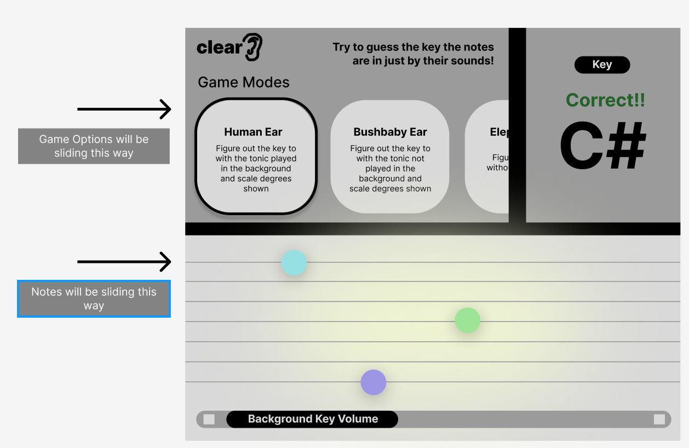

## clearEar- A Project to Train Your Musical Ear

## Game Methodology
There are three levels clearEar:
A random sequence of notes in a major scale are played and you have to guess the key of those notes. The three levels are:
    i. Human Ears: where the tonic is played softly in the background while other notes play and you can see the scale degree of those notes (BONUS: use background volume slider for the tonic)
    ii. Bushbaby Ears: where the tonic is not played in the background but you can see the scale degree of those notes 
    iii. Elephant Ears: where you can only hear the notes and there are no scale degree lines. Note colors appear where the tonic was. Note the band lines don't appear here.
You then try to guess the key in the top-right hand input and it will display "Correct!" or "Incorrect" each time

## Page Structure
There is a navigation bar at the top of clearEar that slides between these different game modes. On the right of the navbar is where you guess the key

The band is below the navbar and the sliding volume changer (BONUS) for Human Ears is below the band

Check out the wireframe below for a better understanding:

## My First Steps:
I will begin the project by using sounds I make on Garageband and downloading them into my project folder
I will use a for loop and constructor function to play a random sound of the 12 notes when I hit the button and it will also display a random color within the band (a div) below 
I will set up event listeners to make the random sounds and display the colors for each game mode

## Links to my Work

Current Trello Project Schedule: https://trello.com/b/enJ4lJfU/clearear-project and Wireframe is above

## Credits 

The resources I will be using will be Garageband, Trello, Figma, and internet research